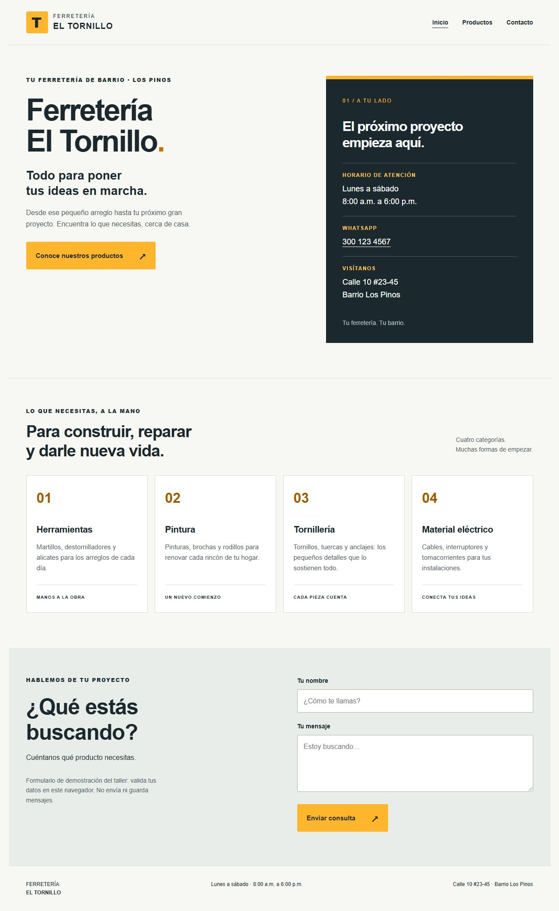
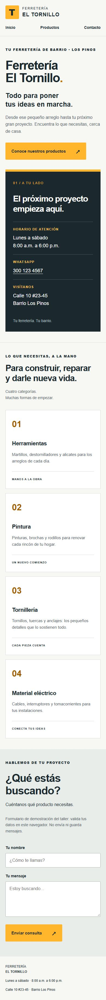

# Verificación del taller

## Resultado local
- HTML, CSS y JavaScript sin frameworks, backend ni base de datos.
- Inicio, productos y contacto presentes. Cuatro tarjetas con las categorías solicitadas.
- Horario y ubicación coinciden con el PDF.
- WhatsApp 300 123 4567 debajo del horario, con enlace a `https://wa.me/573001234567`.
- Formulario probado en navegador: nombre vacío, un carácter y solo espacios muestran aviso; Ana y un mensaje válido muestran éxito de demostración.
- El formulario no envía ni almacena datos; utiliza textContent para mostrar el nombre.
- Revisión visual de escritorio y celular. En la vista móvil, ancho del documento y contenido: 375 px; sin desbordamiento horizontal.
- JavaScript pasó la comprobación de sintaxis.

## Checklist del PDF
- [x] Prompt con contexto, objetivo, restricciones y criterio de aceptación: README.
- [ ] Generación con Antigravity: se realizó con Codex; no se afirma cumplimiento literal.
- [x] Walkthrough con capturas del navegador.
- [x] Sitio completo servido localmente y revisado en navegador.
- [x] Validación del nombre antes de mostrar éxito.
- [x] Repositorio GitHub creado y primera versión subida.
- [x] Cambio final de WhatsApp subido a la cuenta adrianalizeth-dev.
- [x] Proyecto desplegado en Vercel por CLI en adrianalizeth-5464. Integración Git conectada a adrianalizeth-dev/ferreteria-el-tornillo.
- [x] HTTPS público verificado: https://ferreteria-el-tornillo-nu.vercel.app (HTTP 200 y WhatsApp presente).
- [x] Guía de historial y rollback incluida en README.
- [x] Nuevo push reflejado automáticamente en URL pública: commit 9eace57, despliegue automático Ready. Se verificó HTTP 200 y el atributo accesible nuevo del enlace WhatsApp en la URL pública.

Repositorio: https://github.com/adrianalizeth-dev/ferreteria-el-tornillo
